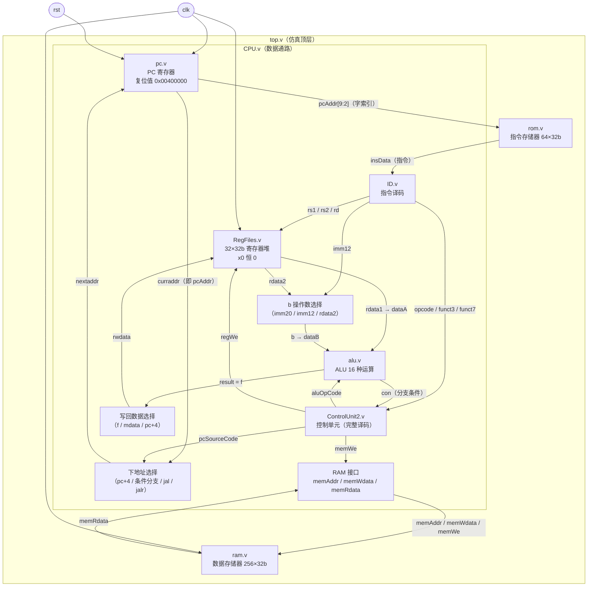

# 02 · 架构与数据通路

本文描述 CPU 的整体结构、信号流、控制信号语义与存储组织。
模块级细节（端口、已知问题）见 [04 · 模块参考](04-module-reference.md)。

## 1. 总体结构

层次关系：`top.v`（仿真顶层）内含 `CPU.v`（数据通路）、`rom.v`（指令存储器）
与 `ram.v`（数据存储器，2026-09 接入）。



等价的线性数据流（取指 → 译码 → 执行 → 存储 → 写回 → 下地址）：

```
取指   PC --addr[9:2]--> ROM --insData--> 译码器 ID
译码   insData --> {rs1, rs2, rd, opcode, funct3, funct7, imm12, imm20}
执行   RegFiles[rdata1, rdata2] + 立即数(imm12 符号扩展 / imm20)
           --> b 选择(imm20/imm12/rdata2) --> ALU --> f；ALU.con --> 控制单元（分支判定）
存储   f(地址) + rdata2(数据) --> RAM 读/写（memWe 来自控制单元）
写回   {f, RAM读数 mdata, pc+4} --> 写回选择 --> RegFiles 写端口
下地址 {pc+4, pc+分支偏移, pc+jal偏移, (rs1+imm12)&~1} --> 下地址选择 --> PC
```

单周期含义：以上全部环节在**一个时钟周期内**组合完成，每个 `posedge clk`
同时更新 PC、寄存器堆（及将来的 RAM）。

## 2. 控制信号语义

来自 `ControlUnit2.v` 端口注释原文，是补完控制单元（见
[03 · 控制真值表](03-instruction-set.md)）的接口约定：

| 信号 | 位宽 | 语义 |
|---|---|---|
| `condition`（`con`） | 1 | ALU 输出的分支条件，`=1` 表示满足 B 类指令跳转条件 |
| `pcSourceCode` | 2 | 下一条指令地址来源：`00` 顺序执行 / `01` 有条件跳转 / `10` jal / `11` jalr |
| `regWe` | 1 | 寄存器堆写使能，`=1` 写入 |
| `memWe` | 1 | RAM 写使能，`=1` 写入 |
| `aluOpCode` | 4 | ALU 运算类型，见下表 |
| `bIsImm` | 1 | ALU 的 b 操作数选择 12 位立即数（符号扩展） |
| `bIs20bImm` | 1 | b 操作数选择 20 位立即数（LUI 用） |
| `regDataIsFromMem` | 1 | 写回数据来源于 RAM（`lw`） |
| `regDataIsFromPC4` | 1 | 写回数据来源于 pc+4（`jal`/`jalr` 保存返回地址） |

> ✅ 旧版曾把 `bIs20bImm` 误接到 20 位 wire `imm20` 上（宽度错配），
> 2026-09 已修复：现接 1 位 wire `is20imm`，`imm20` 由 `ID.v` 驱动，
> 详见 [04 · CPU.v](04-module-reference.md)。

## 3. ALU 操作码表（`alu.v`）

`aluOpCode` 为 4 位，`result` 与 `con` 同周期组合输出；移位量取 `dataB[4:0]`。

| 编码 | 运算 | result | con | 服务指令 |
|---|---|---|---|---|
| `0000` | 加 | `dataA + dataB` | 0 | `add`/`addi`；`lw`/`sw` 地址计算 |
| `0001` | 逻辑左移 | `dataA << dataB[4:0]` | 0 | `sll`/`slli` |
| `0010` | 有符号小于 | `{31'b0, lt_signed}` | `lt_signed` | `slt`（未列入目标）；`blt` 只用 `con` |
| `0011` | 无符号小于 | `{31'b0, lt_unsigned}` | `lt_unsigned` | `sltu`（未列入目标）；`bltu` 只用 `con` |
| `0100` | 异或 | `dataA ^ dataB` | 0 | `xor`/`xori` |
| `0101` | 逻辑右移 | `dataA >> dataB[4:0]` | 0 | `srl`/`srli` |
| `0110` | 或 | `dataA \| dataB` | 0 | `or`/`ori` |
| `0111` | 与 | `dataA & dataB` | 0 | `and`/`andi` |
| `1000` | 减 | `dataA - dataB` | 0 | `sub` |
| `1001` | 相等判定 | 0 | `eq` | `beq` |
| `1010` | 不等判定 | 0 | `ne` | `bne`（未列入目标） |
| `1011` | 有符号 ≥ | 0 | `ge_signed` | `bge`（未列入目标） |
| `1100` | 无符号 ≥ | 0 | `ge_unsigned` | `bgeu`（未列入目标） |
| `1101` | 算术右移 | `dataA >>> dataB[4:0]` | 0 | `sra`/`srai` |
| `1110` | JALR 目标地址 | `(dataA + dataB) & ~32'b1`（清 bit0） | 0 | `jalr` |
| `1111` | LUI | `dataB << 12`（此时 dataB 应为 20 位立即数） | 0 | `lui` |

要点：

- **比较类操作**（`0010`/`0011`/`1001`–`1100`）把判定结果放在 `con` 上，
  供控制单元决定分支是否跳转；`slt`/`sltu` 额外把结果写入 `result`。
- **`bge`/`bgeu`/`bne`** 的 ALU 支持已就绪（`1011`/`1100`/`1010`），
  只是未列入课程目标指令，扩展时仅需在控制单元加译码分支。
- **LUI**（`1111`）由 ALU 把 `dataB` 左移 12 位，因此 b 选择器需为它提供
  20 位立即数（零扩展）。

## 4. 存储组织

| 存储器 | 模块 | 容量 | 端口寻址 | 地址空间 | 初始化 | 读写时序 |
|---|---|---|---|---|---|---|
| 指令存储器 ROM | `rom.v` | 64 × 32b | `addr[7:0]` 接 `pcAddr[9:2]`（字索引 = 字节地址/4） | `0x00400000`–`0x004000FF` | `$readmemh("insData.txt")`，26 条指令占 0–25 号字，其余为 x | 异步（组合）读 |
| 数据存储器 RAM | `ram.v` | 256 × 32b | `addr[7:0]`（字索引） | 自检程序用地址 0（字索引 0） | 无（全 x） | 同步写（posedge）、异步读 |

- PC 复位值 `0x00400000` 与 ROM 基址一致；`pcAddr[9:2]` 丢弃低 2 位
  （RISC-V 指令 4 字节对齐）实现字节地址 → 字索引转换。
- RAM 地址已按与 ROM 一致的风格接入：`memAddr = {2'b00, f[9:2]}`（字节地址
  转字索引）。自检仅访问地址 0（`0(x0)`），字索引/字节地址两种取法都能通过，
  但新代码应保持 `f[9:2]` 风格以便扩展。

## 5. 时序与复位

- **时钟**：仿真中 `InsBenchmark` 用 10ns 周期、`sim.v` 用 20ns 周期；
  全部时序元件（PC、寄存器堆、RAM 写口）在 `posedge clk` 更新。
- **复位**：`pc.v` 为**同步复位、高有效**，复位值 `32'h00400000`。
  仅复位 PC；寄存器堆靠 `initial` 块清零（XSim 生效，FPGA 上综合为初值），
  没有复位逻辑；RAM 无初始化（未写过的单元读出为 x）。
- **关键路径**（决定最高主频）：ROM 读出 → ID 译码 → 控制单元/寄存器堆 →
  ALU → 写回/下地址选择 → PC 建立时间。上板前需看综合时序报告，
  见 [06](06-status-and-roadmap.md)。

## 6. `CPU.v` 内部信号清单（调试用）

| 信号 | 位宽 | 说明 | 现状 |
|---|---|---|---|
| `curraddr` | 32 | PC 当前值，输出为 `pcAddr` | 正常 |
| `nextaddr` | 32 | 下一 PC（四选一：pc+4 / 条件分支 / jal / jalr） | 已实现 |
| `addr4` | 32 | pc+4（顺序地址，兼作 jal/jalr 写回值） | 已实现 |
| `addr_branch` / `addr_jal` / `addr_jalr` | 32 | 三种跳转目标地址 | 已实现 |
| `insData` | 32 | 入口：来自 ROM 的指令 | 正常 |
| `rs1`/`rs2`/`rd` | 5 | ID 译出的寄存器号 | 正常 |
| `opcode` / `func`（funct3）/ `dis`（funct7=ins[30]） | 7/3/1 | ID 译出的操作码字段 | 正常 |
| `imm12` / `imm20` | 12/20 | ID 立即数输出（imm20 支持 U/J 型） | 正常 |
| `imm12_exp` / `imm20_exp` | 32 | 立即数扩展（b 选择器使用） | 已实现 |
| `rdata1`/`rdata2` | 32 | 寄存器堆读出（`a = rdata1`） | 正常 |
| `b` | 32 | ALU b 操作数（imm20/imm12/rdata2 三选一） | 已实现 |
| `f` | 32 | ALU 结果 | 正常 |
| `con` | 1 | ALU 分支条件 → CU | 正常 |
| `rwdata` | 32 | 寄存器堆写数据（f/mdata/pc+4 三选一） | 已实现 |
| `rwe` / `mwe` | 1 | 寄存器堆/RAM 写使能 | 均已使用（`mwe` → `memWe`） |
| `pcsource` | 2 | CU 下地址来源编码 | 已实现（下地址 mux） |
| `isimm` / `is20imm` / `isfm` / `ispc4` | 1 | CU 的 b 选择/写回选择控制 | 均已使用 |
| `mdata` | 32 | RAM 读数（`= memRdata`） | 已接入 |
